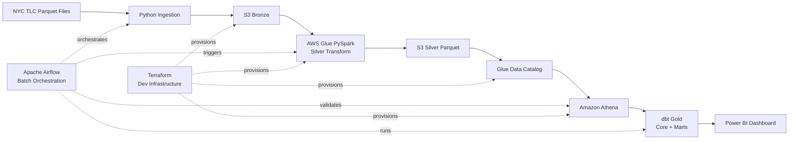

# NYC Taxi AWS Lakehouse

This project is a batch data pipeline for NYC Yellow Taxi analytics.
It processes monthly taxi data on AWS and builds Power BI dashboards from the
cleaned and modeled data.

## Dataset

Source data comes from the NYC Taxi & Limousine Commission trip record dataset.
This project uses Yellow Taxi monthly parquet files plus the taxi zone lookup
CSV for location enrichment.

The current recovery sample is configured in:

```text
config/recovery_sample_months.txt
```

It includes selected months from 2019 to 2024 to compare pre-COVID, COVID-era,
and recovery patterns(~25m rows data). Raw data files are downloaded locally or stored in S3.

The sample intentionally uses selected monthly partitions, mostly January
snapshots plus key COVID recovery months. This keeps Athena/Glue cost low while
still showing year-over-year recovery trends and enough variation for dashboard
analysis.

## Architecture



Airflow orchestrates the batch flow. Terraform provisions the dev cloud
infrastructure.

## Current Scope

- Bronze ingestion and local raw quality profiling
- Silver cleaning, derived metrics, and analytical outlier flags
- Athena catalog and cost-aware validation queries
- dbt Gold star schema and dashboard marts
- Airflow DAG for end-to-end orchestration
- Terraform dev infrastructure: S3, Athena, Glue Catalog, Glue IAM role, Glue job
- Power BI dashboard with 2 pages

## Dashboard

### Page 1: Executive Overview


### Page 2: Demand Analysis


Airflow screenshots will be added after the next company-machine run.

## Repository

```text
nyctx-ingestion/             Download, upload, and local quality profiling
nyctx-glue-processor/        AWS Glue Silver PySpark job and deploy helpers
nyctx-athena-catalog/        Athena DDL, validation SQL, and query guardrails
nyctx-dbt-transformer/       dbt Gold core models and marts
nyctx-airflow-orchestrator/  Airflow DAG and Docker runtime
nyctx-terraform-infra/       Terraform dev infrastructure
nyctx-bi-dashboard/          Power BI file and screenshots
docs/                        Layer rules and data model notes
config/                      Batch month configuration
```

## Business Questions

1. How did taxi trips and revenue recover across sampled months?
2. When does taxi demand peak by hour and day type?
3. What drives changes in average trip value?
4. How do fare, tip, toll, airport fee, and surcharge components contribute?
5. Which records should be excluded from normal analytics as outliers?

## Terraform Dev Infrastructure

Terraform currently provisions an isolated dev environment:

```text
S3 bucket:        nyc-taxi-lakehouse-tntk-dev
Athena:           wg_nyc_taxi_lakehouse_dev, wg_nyc_taxi_dbt_dev
Glue database:    nyc_taxi_lakehouse_dev
Glue role:        glue-nyc-taxi-lakehouse-dev-role
Glue job:         glue-silver-yellow-taxi-dev
```

Terraform manages infrastructure only. Runtime data files, query results,
Power BI files, and Terraform state are not committed.

## Status

Dashboard feature scope is frozen at 2 pages. The next work is hardening:
Terraform docs, dev pipeline validation, Airflow screenshots, and final
portfolio documentation.
