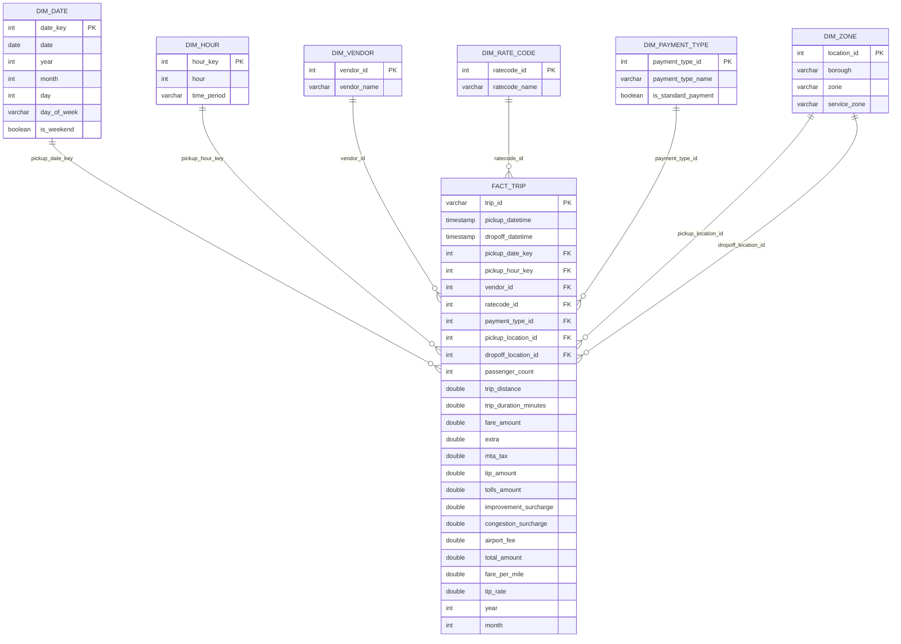

# Gold Layer — Star Schema Data Model

## Overview

The Gold layer implements a **star schema** optimized for analytical queries and dashboards.
`fact_trip` is the central fact table containing one row per valid analytical trip.
Dimension tables provide descriptive context for each foreign key in `fact_trip`.

> **Note on dbt Lineage Graph:** dbt's lineage graph reflects SQL `source()` / `ref()` dependencies,
> not logical fact-to-dimension relationships. The ERD below is the correct star schema for this project.

---

## Star Schema Diagram

---

## Dimension Tables

| Table | Type | Source | Description |
|---|---|---|---|
| `dim_date` | Date | Silver `pickup_date` | Calendar attributes derived from Silver pickup dates |
| `dim_hour` | Hour | Static values | 24-hour slots with `time_period` classification |
| `dim_vendor` | Vendor | Static values | Taxi vendor lookup (VeriFone, CMT) |
| `dim_rate_code` | Rate code | Static values | Trip rate code lookup |
| `dim_payment_type` | Payment | Static values | Payment method lookup |
| `dim_zone` | Zone | Reference `taxi_zone_lookup.csv` | Taxi zone, borough, and service zone |

---

## Fact Table

| Column | Type | Description |
|---|---|---|
| `trip_id` | `varchar` PK | MD5 surrogate key derived from trip attributes |
| `pickup_date_key` | `int` FK | `yyyyMMdd` integer joining `dim_date.date_key` |
| `pickup_hour_key` | `int` FK | Hour 0–23 joining `dim_hour.hour_key` |
| `vendor_id` | `int` FK | Joins `dim_vendor.vendor_id` |
| `ratecode_id` | `int` FK | Joins `dim_rate_code.ratecode_id` |
| `payment_type_id` | `int` FK | Joins `dim_payment_type.payment_type_id` |
| `pickup_location_id` | `int` FK | Joins `dim_zone.location_id` |
| `dropoff_location_id` | `int` FK | Joins `dim_zone.location_id` |
| `fare_per_mile` | `double` | Derived metric: `fare_amount / trip_distance` |
| `tip_rate` | `double` | Derived metric: `tip_amount / fare_amount` |

**Filter:** `is_analytical_outlier = false` — trips with extreme distance, duration, or fare are excluded from the Gold layer.

---

## Mart Roadmap

Marts join `fact_trip` with dimension tables to produce dashboard-ready aggregations.
Each mart will add visible edges in the dbt Lineage Graph.

| Mart (planned) | Uses | Answers |
|---|---|---|
| `mart_daily_trip_revenue` | `fact_trip` + `dim_date` | Daily trip count, revenue, tip rate |
| `mart_hourly_demand` | `fact_trip` + `dim_hour` + `dim_date` | Peak hours by day type |
| `mart_pickup_zone_performance` | `fact_trip` + `dim_zone` | Revenue and demand by pickup zone |
| `mart_payment_behavior` | `fact_trip` + `dim_payment_type` | Payment mix and tip behavior |
